# Vaxxie

### ¿Que es esto?

Vaxxie es un bot que habla español y acepta preguntas básicas sobre la reserva de vacunas, y/o puede ayudarlo a encontrar citas de vacunas con proveedores de vacunas de uso común.

### ¿Cómo uso esto?

Si estás en Slack:
1. Cree un nuevo mensaje directo para Vaxxie
2. ¡Di algo!

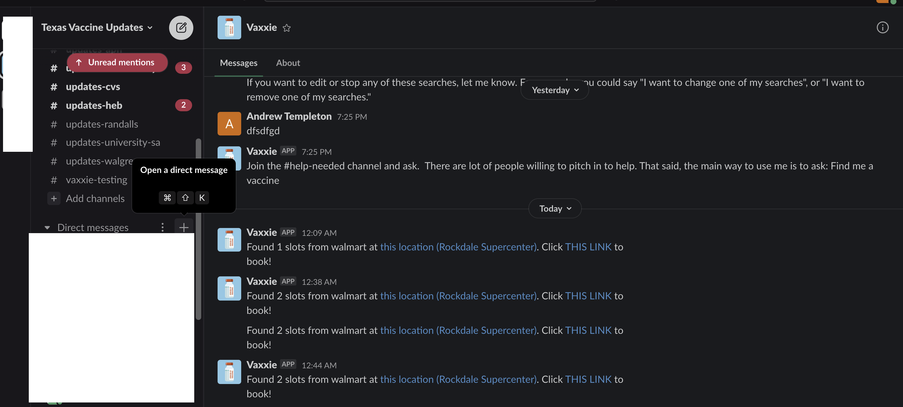
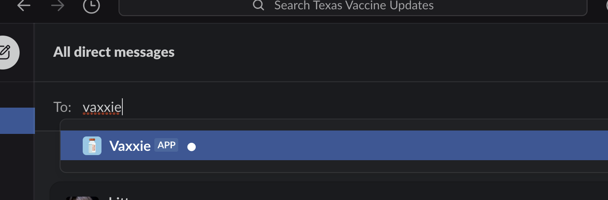

Debido a que Vaxxie habla español, Vaxxie intentará entender lo que dices en oraciones completas o frases cortas, y no necesita comandos especiales para interactuar con él. Por supuesto, Vaxxie hace muchas cosas, así que veamos un ejemplo de cada una de las cosas que puede pedirle a Vaxxie que haga ...

###### Buscar una vacuna / Agregar una nueva área de búsqueda

Pídale a Vaxxie que le busque una cita o una vacuna. Le pedirá su código postal y la distancia que desea recorrer en millas para una cita.

###### Lista mis búsquedas activas

Pregúntele a Vaxxie "¿Qué está buscando para mí en este momento" o "enumere mis búsquedas" y le mostrará una lista numerada de las búsquedas actualmente activas, por tiempo de solicitud, código postal y distancia que desea viajar.

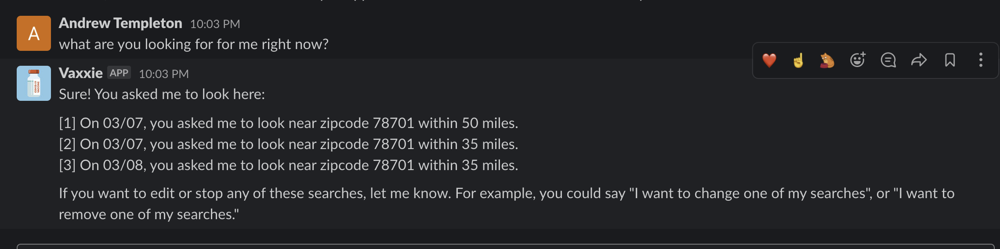

###### Actualizar una búsqueda activa (cambiar código postal o distancia de viaje)

Pídale a Vaxxie un formulario simple, como "actualizar una búsqueda", o una versión compleja, como "actualizar el número de búsqueda 2 para que esté en 78701 y 35 millas". Si hace una versión más simple sin detalles o solo información parcial, le pedirá la otra información requerida. Si no puede recordar cuál es el número de búsqueda, simplemente pregunte "enumerar mis búsquedas" o algo así y Vaxxie se los mostrará nuevamente, con sus números.

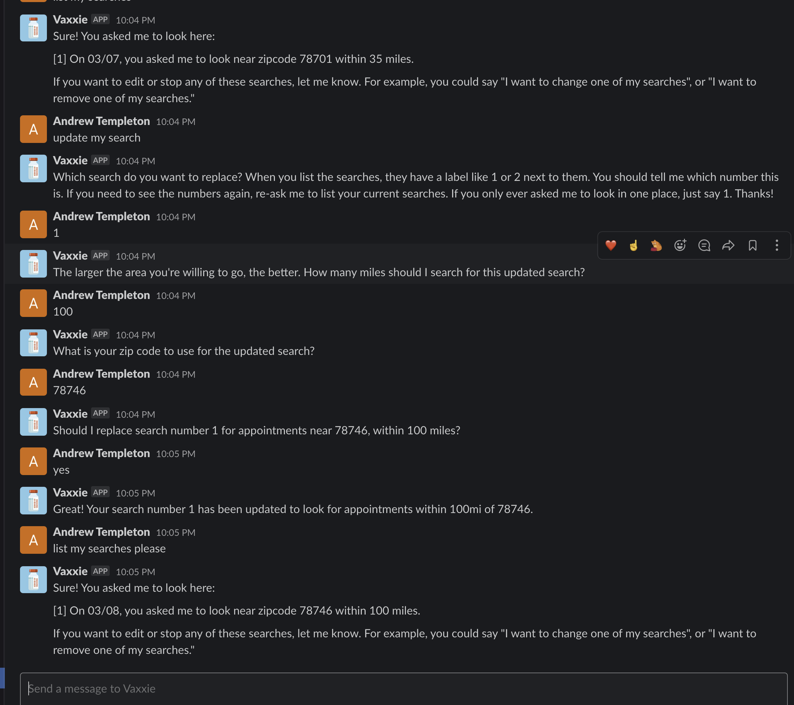

###### Eliminar una búsqueda activa

Pregúntele a Vaxxie el formulario simple, como "elimine una búsqueda por favor", o complete el formulario, como "elimine el número de búsqueda 2". Si solicita el formulario simple, Vaxxie le pedirá el número de búsqueda que desea eliminar. Si no recuerda qué número, vuelva a pedirle a Vaxxie que "enumere mis búsquedas" para ver la numeración nuevamente.

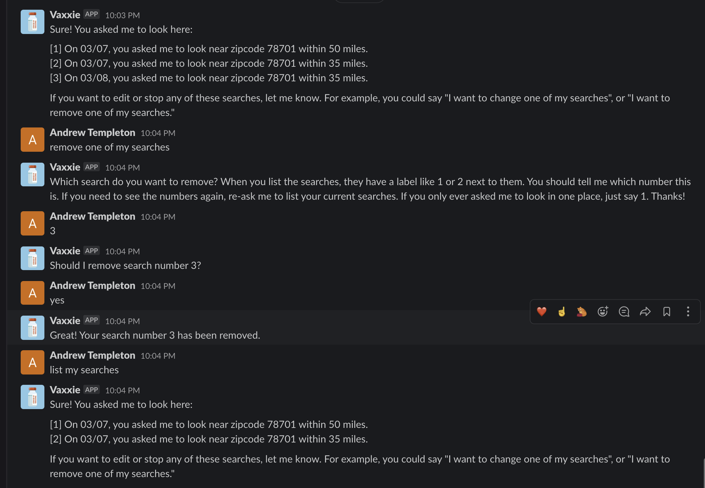

###### Preguntas frecuentes: documentación de reserva

Puede preguntar qué información debe tener lista al hacer la reserva.

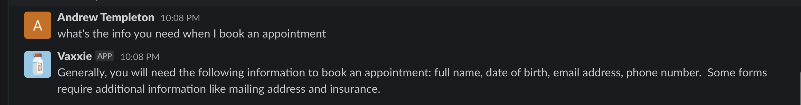

###### Preguntas frecuentes: cancelación de citas

Puede preguntar cómo cancelar una cita.

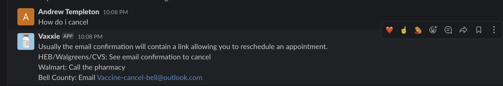

###### Preguntas frecuentes: documentación para llevar

Puedes preguntar qué documentación traer al acudir a la cita.

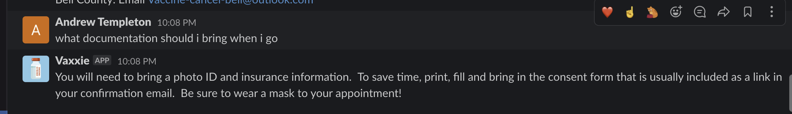

###### Preguntas frecuentes: ¿Qué pasa si llego tarde?

Puede preguntar qué hacer si llega tarde.

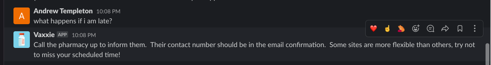

###### Preguntas frecuentes: ¿Qué pasa con las tomas sobrantes?

Puede preguntar sobre las dosis / inyecciones sobrantes de vacunas.

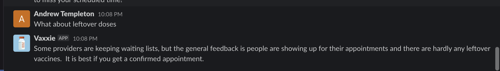

###### Preguntas frecuentes: No encuentro una oportunidad

Puede preguntar qué hacer si no puede encontrar una cita.

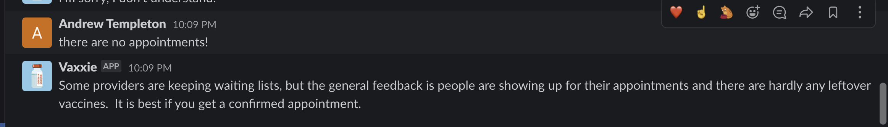

###### Preguntas frecuentes: ¿Cómo puedo reprogramar?

Puede preguntar cómo reprogramar.

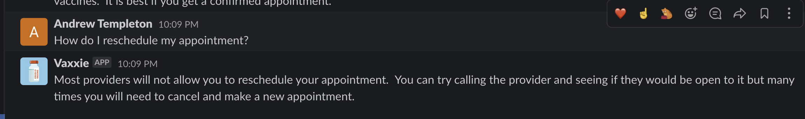

###### Preguntas frecuentes: preguntas sobre la segunda cita

Puede preguntar sobre segundas citas.

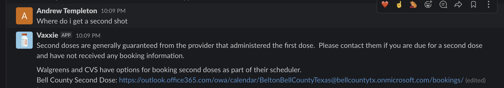

###### Preguntas frecuentes: transferencia de citas

Puede preguntar sobre la transferencia de citas.

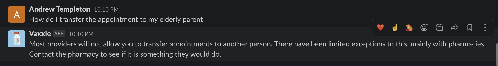

### ¿Qué pasa con la privacidad?

Este bot solo recopila:
1. Su ID de usuario de Slack, que NO es su nombre. Es su ID de máquina, con el formato `U01ML0ZFEKZ` (¡Esta es mi ID real de Texas Vaccine Updates Slack!) Y no contiene información personal.
2. El código postal que ingresa, únicamente para que pueda determinar qué vacunas enviarle.
3. La latitud y longitud del código postal que ingresó. NO usa su ubicación, solo un punto de una base de datos pública de códigos postales. La latitud y longitud reales frente al archivo de código postal está disponible en este código fuente abierto.
4. La cantidad de millas que dijo que iría, para que el bot pueda decir qué disparos están lo suficientemente cerca para el usuario que envía.
5. La hora en que solicitó la búsqueda y solicitó su primera búsqueda a Vaxxie. Esto es así cuando Vaxxie enumera las citas que solicitó anteriormente, puede poner una fecha, como "Me pidió en MM / DD que buscara en ZIP dentro de DISTANCE".

Este es mi usuario personal con Vaxxie, en forma completa, para demostrar que no hay información personal en uso.

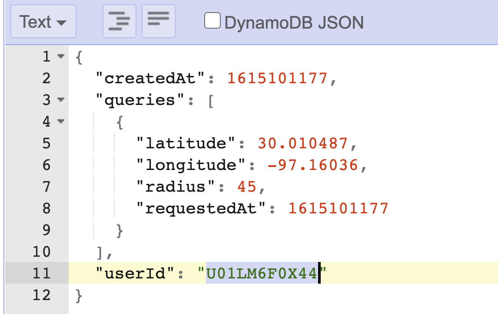

### Créditos

 - Yo, Andrew Templeton ([LinkedIn](https://www.linkedin.com/in/andrew-templeton-22883a23/), [Twitter](https://twitter.com/ayetempleton) y [estoy contratando!](https://www.indeed.com/cmp/CSC-Generation/jobs))
 - [Andy Yiu](https://www.linkedin.com/in/andyyiu/) Modelo de idioma de preguntas frecuentes y conjunto de respuestas de Vaxxie para las preguntas de los usuarios
 - [Trevor Hedley](https://github.com/codeisafourletter) Ayudó con el modelo de lenguaje para "encontrarme una vacuna" por código postal.
 - [Vaccine Spotter API](https://www.vaccinespotter.org/) * Uso intensivo * de sus datos para impulsar las visitas de Vaxxie. No estoy afiliado pero los amo * mucho *.

# NO AFILIADO A TEXASUPDATES.COM (Texas Vaccine Updates)

James Kip ([¡Mira su perfil de GitHub!](Https://github.com/jameskip)) y [Sara Dubuque](https://www.linkedin.com/in/saradubs/) de [Actualizaciones de vacunas de Texas](https://general.texasupdates.com) son seres humanos maravillosos y me permitieron usar Slack como mi banco de pruebas. Los desarrolladores y usuarios adicionales en Slack fueron fundamentales para probar Vaxxie cuando era solo un pequeño bot. Dicho esto, no están afiliados a este bot de ninguna manera formal y NO deben ser contactados para obtener ayuda. Los desarrolladores pueden abrir problemas de GitHub contra el bot. Los usuarios habituales pueden comunicarse conmigo ([@ayetempleton](https://twitter.com/ayetempleton) en Twitter - yo hablo español) a través de un tweet o un mensaje directo si tienen preguntas; sin embargo, eso nos lleva a la garantía ...;)

# ¡SIN GARANTÍA PARA NINGÚN PROPÓSITO!

EL SOFTWARE SE PROPORCIONA "TAL CUAL", SIN GARANTÍA DE NINGÚN TIPO, EXPRESA O IMPLÍCITA, INCLUYENDO, PERO NO LIMITADO A, LAS GARANTÍAS DE COMERCIABILIDAD, APTITUD PARA UN PROPÓSITO PARTICULAR Y NO INFRACCIÓN. EN NINGÚN CASO LOS AUTORES O TITULARES DE LOS DERECHOS DE AUTOR SERÁN RESPONSABLES DE CUALQUIER RECLAMO, DAÑOS U OTRA RESPONSABILIDAD, YA SEA EN UNA ACCIÓN DE CONTRATO, AGRAVIO O DE OTRO MODO, QUE SURJA DE, FUERA DE O EN RELACIÓN CON EL SOFTWARE O EL USO U OTRAS NEGOCIACIONES EN EL SOFTWARE.

# USTED ES EL ÚNICO RESPONSABLE DE VERIFICAR LA ELEGIBILIDAD DE LAS PERSONAS QUE UTILIZA PARA RESERVAR ESTO

No soy abogado ni profesional de la salud. Ni yo, esta aplicación ni ningún colaborador hacemos ninguna declaración con respecto a usted o cualquier persona a la que reserve la elegibilidad para hacer una reserva en su estado respectivo. Es responsabilidad exclusiva del usuario asegurarse de que su uso sea justo y legal dentro del estado de dicho usuario y titular de la cita.

# NO HAY DECLARACIONES DE ASESORAMIENTO MÉDICO, ASESORAMIENTO LEGAL O DECLARACIONES DE HECHO

La información proporcionada en este documento no es un consejo legal. Yo no soy un abogado. La información proporcionada en este documento no es un consejo médico. No soy médico. No se garantiza que la información proporcionada en este documento sea precisa y es propensa a errores debido a la naturaleza cambiante de la disponibilidad y la política de vacunas. Es su exclusiva responsabilidad verificar las políticas y leyes gubernamentales vigentes relacionadas con la asignación de vacunas. Es su exclusiva responsabilidad verificar que cualquier vacuna o cita de vacuna que se muestre como disponible sea apropiada para usted o la persona para la que está reservando.

# NO APTO PARA MENORES O DEPENDIENTES

No puede utilizar esta aplicación a menos que tenga la mayoría de edad legal en su jurisdicción. El uso de este sistema o la interacción con él está prohibido si usted es menor de edad o si no está legalmente capacitado para tomar sus propias decisiones. No interactúe con Vaxxie o cualquier software relacionado si pertenece a estas categorías.

# USO JUSTO

No puede utilizar esta herramienta para eludir los sistemas informáticos de ninguna red de agencia gubernamental, red corporativa o cualquier otra red de terceros. No utilice esta herramienta para realizar reservas automatizadas. No utilice esta herramienta para "reservar" espacios para citas.

# PUEDE APAGARSE A DISCRECIÓN EXCLUSIVA DE LOS OPERADORES

El software puede dejar de ofrecerse sin ninguna causa, advertencia o razón. El software y los sistemas en ejecución se operan y pueden apagarse a discreción exclusiva de los operadores. No tiene derecho a que los servicios sigan funcionando.
