# Vaxxie

### What is this?

Vaxxie is a bot which speaks English and accepts basic questions about vaccine booking, and/or can help you find vaccine appointments from commonly used vaccine providers.

### How do I use this?

If you're in Slack:
1.  Create a new Direct Message to Vaxxie
2.  Say something!

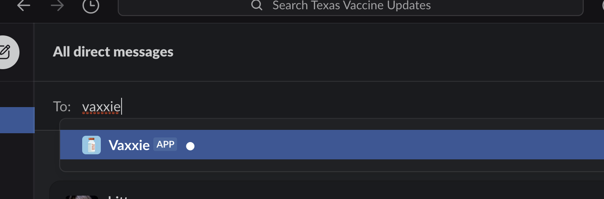

Because Vaxxie speaks English, Vaxxie will try to understand what you say in complete sentences or short phrases, and does not need special commands to interact with itf course, Vaxxie does a lot of things, so let's look at an example of each of the things you can ask Vaxxie to do...

###### Find a Vaccine / Add a new search area

Ask Vaxxie to find you an appointment or shot. It will ask for your zipcode and how far you want to go in miles for an appointment.

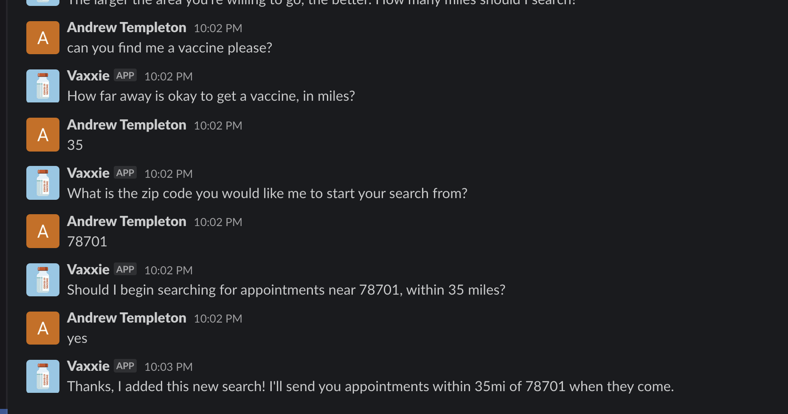

###### List my active searches

Ask Vaxxie "What are you looking for for me right now" or "list my searches" and it will show you a numbered list of currently-active searches, by time of request, zipcode, and distance willing to travel.

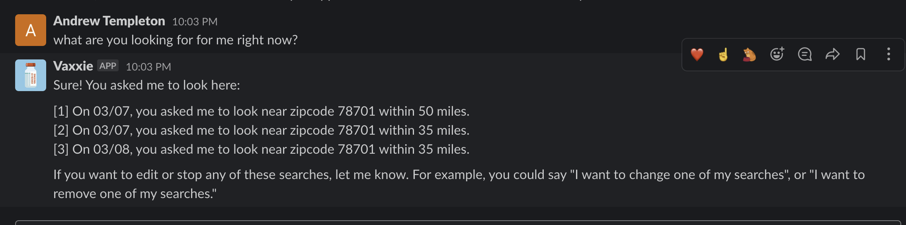

###### Update an active Search (change zipcode or distance of travel)

Ask Vaxxie a simple form, like "update a search", or a complex version, like "update search number 2 to be in 78701 and 35 miles". If you do a simpler version with no specifics or only partial information, it will ask for the other required information. If you can't remember which search number is which, just ask "list my searches" or something like that and Vaxxie will show you them again, with their numbers.

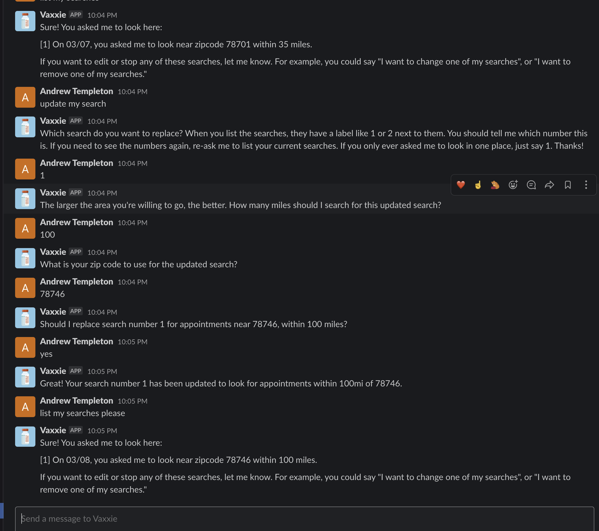

###### Remove an active search

Ask Vaxxie the simple form, like "remove a search please", or complete form, like "please remove search number 2". If you ask the simple form, Vaxxie will ask for the search number you want to remove. If you don't remember which number, just re-ask Vaxxie to "list my searches" to see the numberings again.

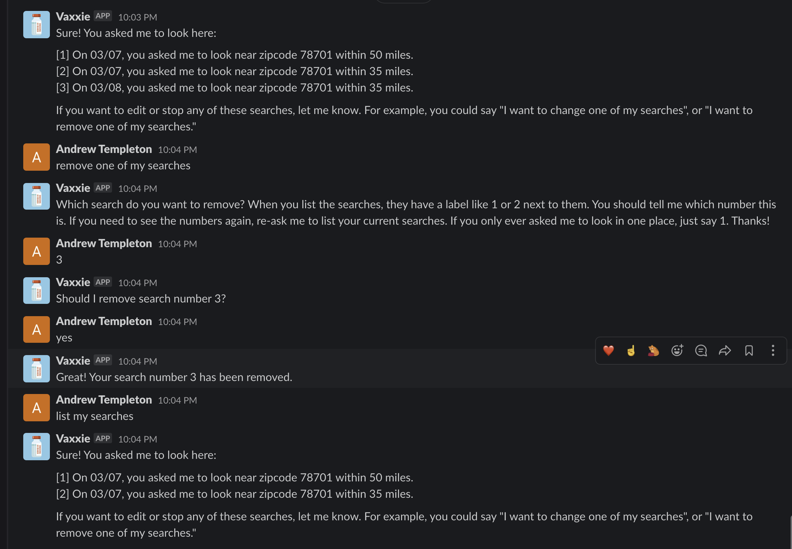

###### FAQ: Booking Documentation

You can ask what info to have ready when booking.

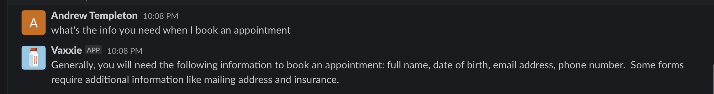

###### FAQ: Cancelling Appointments

You can ask how to cancel an appointment.

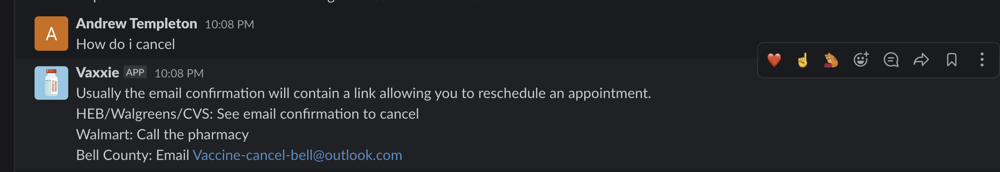

###### FAQ: Documentation to Bring

You can ask what documentation to bring when going to the appointment.

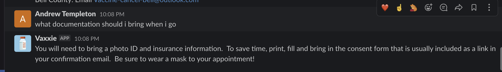

###### FAQ: What If I am Late

You can ask what to do if you are late.

###### FAQ: What About Leftover Shots

You can ask about leftover vaccine doses/shots.

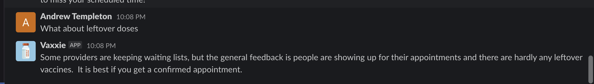

###### FAQ: I Can't Find A Shot

You can ask what to do if you can't find an appointment.

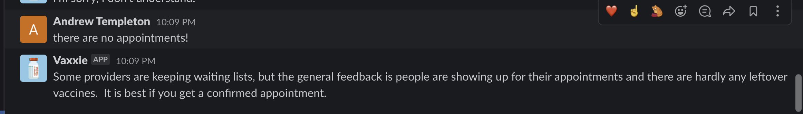

###### FAQ: How Do I Reschedule

You can ask how to reschedule.

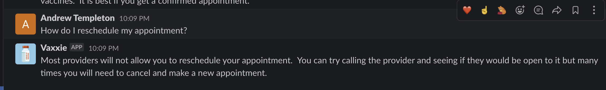

###### FAQ: Second Appointment Questions

You can ask about second appointments.

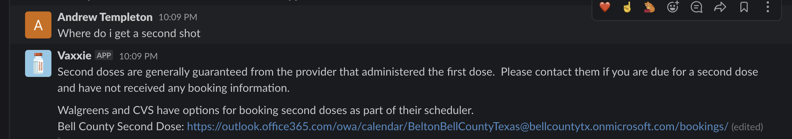

###### FAQ: Transferring Appointments

You can ask about transferring appointments.

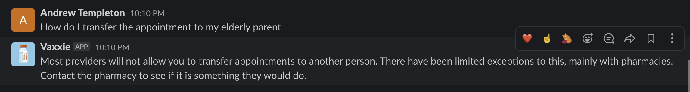

### What about privacy?

This bot only collects:
1.  Your Slack user ID, which is NOT your name. It's your machine ID, of the form `U01ML0ZFEKZ` (This is my actual ID from the Texas Vaccine Updates Slack!) and has no personal information on it.
2.  The zipcode you enter in, solely so it can determine which vaccines to send you.
3.  The Latitude and Longitude of the zipcode you enter. It does NOT use your location, only a point from a public database of zipcodes. The actual latitude and longitude versus zipcode file is available in this open source code.
4.  The number of miles you said you would go, so that the bot can tell which shots are close enough for the user you submit.
5.  The time you requested the search, and asked for your very first search from Vaxxie. This is so when Vaxxie lists appointments you previously asked for, it can put a date on it, like "You asked me on MM/DD to look in ZIP within DISTANCE".

This is my personal user with Vaxxie, in complete form, to demonstrate there is no personal information in use.

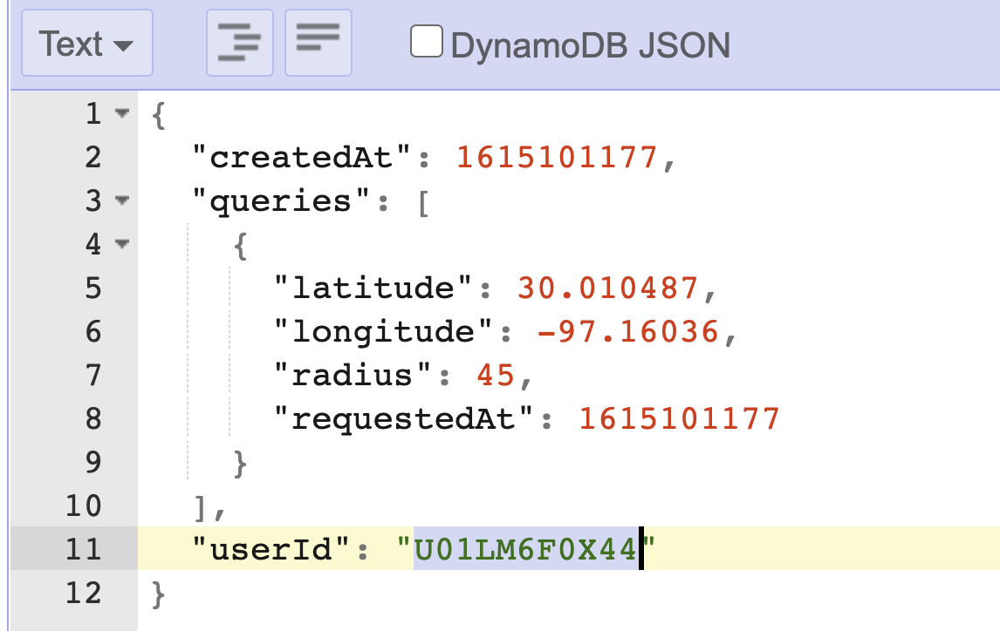

### Credits

 - Me, Andrew Templeton ([LinkedIn](https://www.linkedin.com/in/andrew-templeton-22883a23/), [Twitter](https://twitter.com/ayetempleton), and [I'm hiring!](https://www.indeed.com/cmp/CSC-Generation/jobs))
 - [Andy Yiu](https://www.linkedin.com/in/andyyiu/) FAQs language model and Vaxxie's response set for user questions
 - [Trev]([Trevor Hedley](https://github.com/codeisafourletter) Helped with the language model for "find me a vaccine" by zipcode.
 - [Vaccine Spotter API](https://www.vaccinespotter.org/) *Heavily* using their data to drive Vaxxie's hits. Not affiliated but love them *dearly*.

# NOT AFFILIATED WITH TEXASUPDATES.COM

@James ([Check out his GitHub profile!](https://github.com/jameskip)) from [Texas Vaccine Updates](https://general.texasupdates.com) is a wonderful human and allowed me to use the Slack as my testbed. Additional developers and users in the Slack were integral in testing out Vaxxie when it was just a wee bot. That said, they are not affiliated with this bot in any formal capacity and should NOT be reached out to for support. Developers may open GitHub Issues against the bot. Regular users may reach out to me ([https://twitter.com/ayetempleton]((@ayetempleton) on Twitter) via a tweet or a direct message if they have questions - however, that leads us to warranty... ;)

# NO WARRANTY FOR ANY PURPOSE!

THE SOFTWARE IS PROVIDED “AS IS”, WITHOUT WARRANTY OF ANY KIND, EXPRESS OR IMPLIED, INCLUDING BUT NOT LIMITED TO THE WARRANTIES OF MERCHANTABILITY, FITNESS FOR A PARTICULAR PURPOSE AND NONINFRINGEMENT. IN NO EVENT SHALL THE AUTHORS OR COPYRIGHT HOLDERS BE LIABLE FOR ANY CLAIM, DAMAGES OR OTHER LIABILITY, WHETHER IN AN ACTION OF CONTRACT, TORT OR OTHERWISE, ARISING FROM, OUT OF OR IN CONNECTION WITH THE SOFTWARE OR THE USE OR OTHER DEALINGS IN THE SOFTWARE.
